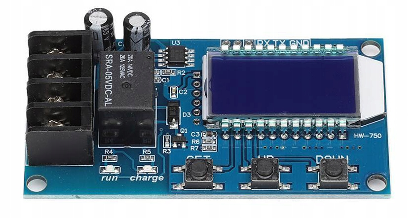
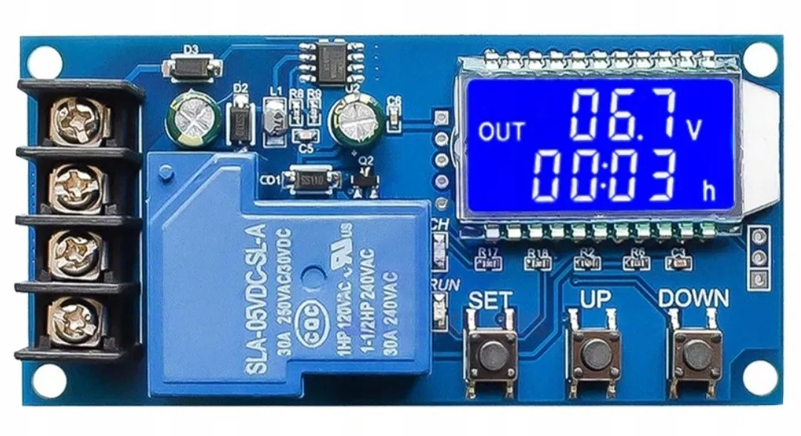

<h3 align="center">Python-Class for control Charge Controllers</h3>
<h4 align="center">XY-L10A or XY-L30A</h3>

<br />

<div align="center">
    
    
</div>

### Controllers XY-L10A and XY-L30A working via UART

### Basic Usage
<br />

Class init
```py
import xy_lxxa as CTRL
ups = CTRL.XYCTRL(port='/dev/ttyUSB0', baudrate=9600, timeout=0.1)
```
timeout in 0.1s use after send command to controller

<br />

Get Controller-settings
```py
try:
    data = ups.readSettings()
    if data == 'NO_DATA':
        print('Can not read settings from controller...')
    else:
        LV, HV, T = data
        print(f'Low Voltage: {LV}')
        print(f'High Voltage: {HV}')
        print(f'Time: {T}\n')
except Exception as e:
    print(e)
```
<br />

Get Measures
```py
try:
    data = ups.readMeasure()
    if data == 'NO_DATA':
        print('Can not read measures from controller...')
    else:
        V, P, T, S = data
        print(f'Battery: {V}')
        print(f'Charge: {P}')
        print(f'Time: {T}')
        state = 'ON' if S == 'CL' else 'OFF'
        print(f'State: {state}')
except Exception as e:
    print(e)
```
<br />

Setup Voltage histeresis
```py
try:
    if ups.setVoltage(12.1, 12.6) == 'OK':
        print('Set Voltage OK')
except Exception as e:
    print(e)
```
<br />

Relay Switch ON
```py
try:
    if ups.control(1) == 'ON':
        print('Relay is ON')
    else:
        print('Relay is OFF')
except Exception as e:
    print(e)
```
<br />

Relay Switch OFF
```py
try:
    if ups.control(0) == 'ON':
        print('Relay is ON')
    else:
        print('Relay is OFF')
except Exception as e:
    print(e)
```
<br />

Set Timer
```py
try:
    if ups.setTime(0, 10) == 'OK':
        print('Set timer OK (10 minutes)')
    else:
        print('Can not set up timer')
except Exception as e:
    print(e)
```
<br />

Start stream ang subscribe on it
```py
streamWorks = False
try:
    if ups.startStream() == 'STREAM_STARTED':
        print('Stream started successfully')
        streamWorks = True
except Exception as e:
    print(e)
# Read data from stream
count = 1
try:
    while streamWorks:
        data = ups.readFromStream()
        if data == 'NO_DATA':
            print('Can not read measures from stream')
        else:
            V, P, T, S = data
            counter = '{:0>5.0f}'.format(count)
            print(f'\n----------{counter}----------')
            print(f'Battery: {V}')
            print(f'Charge: {P}')
            print(f'Time: {T}')
            state = 'ON' if S == 'CL' else 'OFF'
            print(f'State: {state}')
        count += 1
        time.sleep(3)
except Exception as e:
    print(e)
    streamWorks = False

except KeyboardInterrupt:
    pass
finally:
    try:
        if ups.stopStream() == 'STREAM_STOPPED':
            print('Stream stop OK')
        else:
            print('Can not stop stream')
    except Exception as e:
        print(e)
    ups.disconnect()
```
<br />

Disconnect
```py
try:
    if ups.disconnect() == 'DISCONNECTED':
        print('Disconnected successfully')
    else:
        print('Can not disconnect')
except Exception as e:
    print(e)
```
